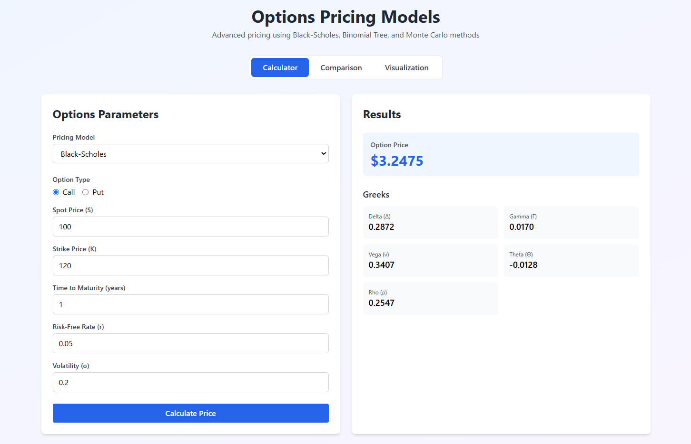

# Demo Images Successfully Added ✅

## What Was Done

### 1. Images Organized
Copied your three screenshot images from `frontend/assets/` to the project root `assets/` folder:

```
assets/
├── Calculator.png      (116 KB)
├── Comparison.png      (191 KB)
└── Visualisation.png   (137 KB)
```

### 2. README.md Updated
Enhanced the **Demo** section with:
- Professional descriptions for each screenshot
- Properly formatted image references
- Enhanced "Key Features" list

### 3. Git Status
All images are staged and ready to commit:

```
M  README.md
A  assets/Calculator.png
A  assets/Comparison.png
A  assets/Visualisation.png
```

## How It Looks in README.md

The Demo section now displays:

### **Options Calculator**
Description: Price options using Black-Scholes, Binomial Tree, or Monte Carlo models with real-time calculations and Greeks.

Image: ``

---

### **Model Comparison**
Description: Compare pricing results across all three models side-by-side to understand model differences and convergence.

Image: ``

---

### **Interactive Visualizations**
Description: Generate beautiful charts showing option prices, Greeks, Monte Carlo paths, and sensitivity analysis.

Image: ``

---

## Key Features Listed
- ✅ Real-time Calculations
- ✅ Interactive Parameter Inputs
- ✅ Responsive Design
- ✅ Beautiful Visualizations
- ✅ REST API
- ✅ Multiple Models
- ✅ Comprehensive Analytics

## On GitHub
When you push these changes, the images will appear directly in your README.md on GitHub, making your project look professional and visually appealing!

### Image Paths
GitHub will render the images using relative paths:
- `assets/Calculator.png`
- `assets/Comparison.png`
- `assets/Visualisation.png`

These paths work both on GitHub and in local markdown viewers.

## Next Steps

### Option 1: Commit Everything Now
```bash
git add .
git commit -m "docs: add demo screenshots and enhance README

- Added three demo screenshots (Calculator, Comparison, Visualizations)
- Enhanced Demo section with descriptions
- Organized images in assets/ folder
- Updated Key Features list"
git push origin main
```

### Option 2: Review First
1. Open README.md in a markdown preview tool
2. Verify images display correctly
3. Make any adjustments
4. Then commit and push

## File Locations

### Images Are In:
```
/assets/
  - Calculator.png
  - Comparison.png
  - Visualisation.png
```

### Referenced In:
- `README.md` (Demo section, lines 53, 58, 63)

## Tips for Best Display

### On GitHub:
- Images will auto-resize to fit the page width
- Click to view full size
- They'll appear in light/dark mode appropriately

### Optional Enhancements:
1. **Add hover text:**
   ```markdown
   
   ```

2. **Link images to larger versions (if you have them):**
   ```markdown
   [](assets/Calculator-large.png)
   ```

3. **Add a GIF demo:**
   Record a quick walkthrough and add it at the top of the Demo section

## Verification

To verify the images will display correctly on GitHub, you can:

1. **Use GitHub's preview locally:**
   ```bash
   # Install grip (GitHub README preview)
   pip install grip

   # Preview README
   grip README.md
   # Open http://localhost:6419
   ```

2. **Or commit to a branch first:**
   ```bash
   git checkout -b demo-images
   git add .
   git commit -m "Add demo screenshots"
   git push origin demo-images
   ```
   Then view on GitHub before merging to main.

---

Your README now has professional demo screenshots that will make your project stand out! 🎉
